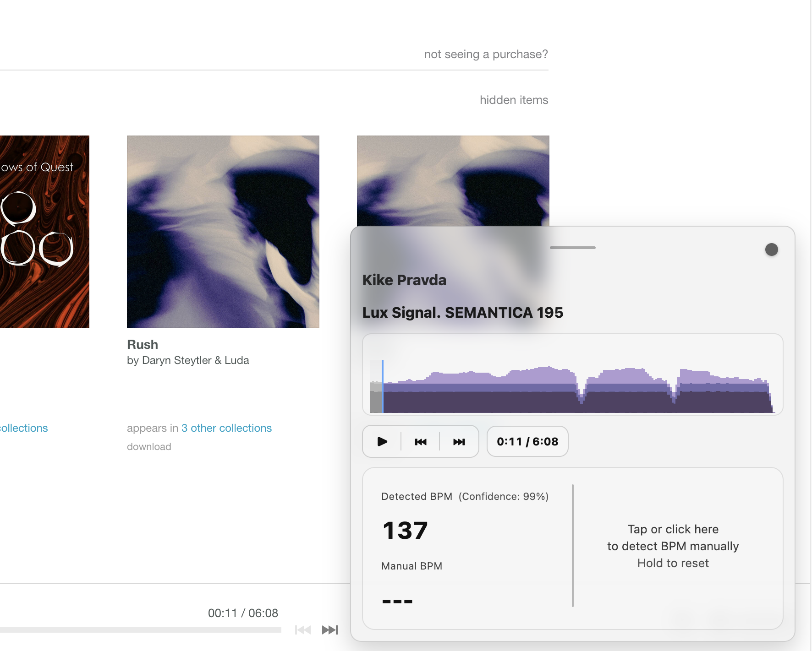

# Bandcamp Player Extension

Bandcamp Player Extension is a floating music companion for Bandcamp.
Built with a lot of dedicated work and the help of AI-assisted development.



## Features

- 🎯 **BPM Detection** — Powered by [Essentia](https://essentia.upf.edu/)
  for accurate, real-time tempo readings
- 🥁 **Tap Tempo** — Manually tap out the BPM when you want
  to double-check by ear
- ✨ **Clean Playback UI** — A minimal floating player that stays
  out of your way while you browse
- 📂 **Extended Playlist Controls** — Smarter navigation to make
  digging for tracks faster and more fun

## Latest Changes (v2.5)

- Added a robust playlist workflow across album, track, collection, feed, and recommendation contexts.
- Added an Information button (`i`) with quick links for feedback and support.
- Improved playlist/playback syncing and stability when switching between page-native and external playlist sources.

## What Is Essentia?

Essentia is an open-source audio analysis library. This project uses `essentia.js` (its WebAssembly/JavaScript version) to estimate BPM more reliably than simple heuristics.

## Installation

Download this build and install dependencies:

```bash
git clone https://github.com/tobias-d/bandcamp-player-extension.git
cd bandcamp-player-extension
git checkout codex/playlist
npm install
```

Build:

```bash
npm run build:firefox
# or
npm run build:chrome
```

Load in Firefox (temporary):

1. Open `about:debugging#/runtime/this-firefox`
2. Click `Load Temporary Add-on...`
3. Select `dist/manifest.json`

## Project Structure

- `src/content-scripts/bandcamp-player.ts`: content orchestration and player state sync
- `src/content-scripts/playlist.ts`: playlist resolution, ordering, and track switching
- `src/background/messaging.ts`: message routing between content and background
- `src/background/analyzer.ts`: BPM + waveform analysis orchestration
- `src/background/tempo-essentia.ts`: Essentia-based tempo estimation
- `src/background/waveform.ts`: waveform generation and cache
- `src/ui/results-panel.ts`: floating player and panel UI rendering

## License

Project source is MIT-licensed (see `LICENSE`).

This project uses `essentia.js` (`AGPL-3.0`). If you distribute the extension, ensure compliance with AGPL obligations for that dependency.

See:
- `docs/THIRD_PARTY_NOTICES.md`
- `node_modules/essentia.js/LICENSE`
