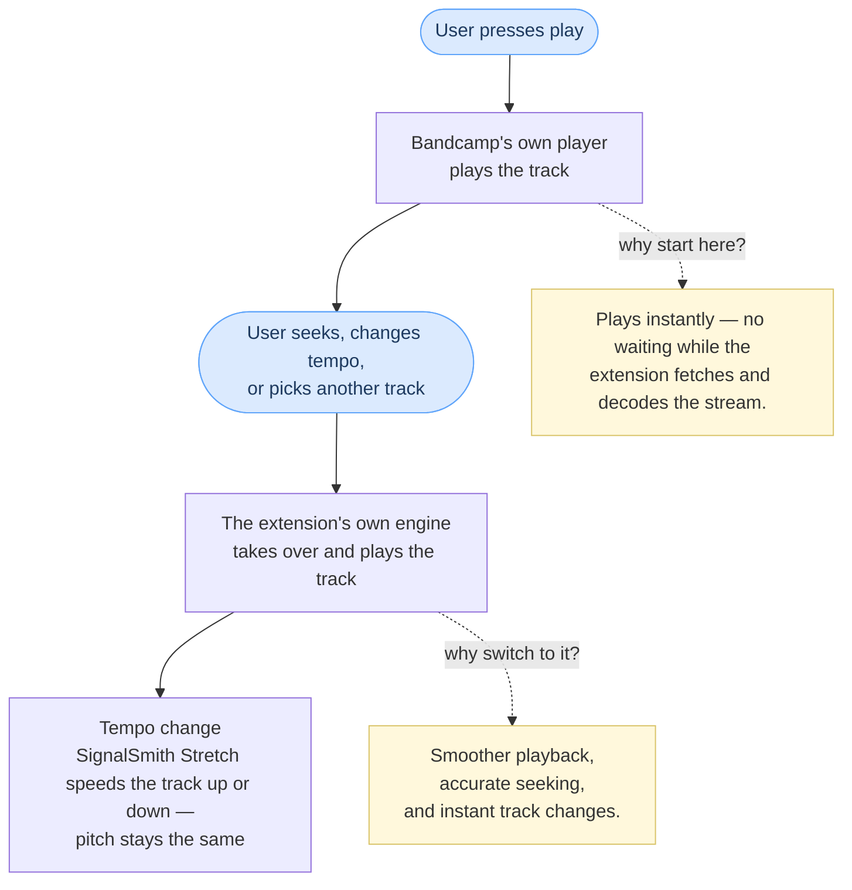
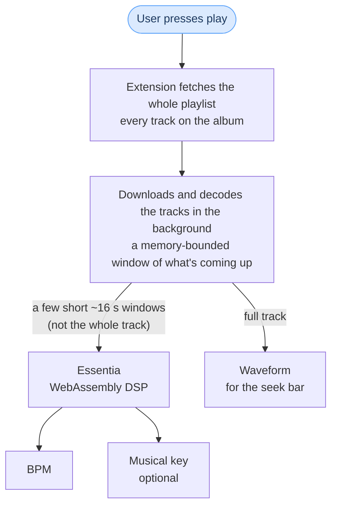

# Bandcamp Deck v3

Bandcamp Deck is a cross-browser extension (Firefox MV2 + Chrome MV3 from one source tree)
that overlays Bandcamp with a persistent floating player panel. The panel follows the
currently playing track across release pages, fan/feed/recommendation pages, and Discover,
and keeps transport, waveform seeking, playlist context, real audio analysis, and
wishlist state in one place.

For developers, the two parts worth reading are its **audio engine and signal analysis** and its
**Bandcamp-API identity work** — see [Architecture](#architecture). The rest is a thin UI over them.

## Download

- **Chrome / Chromium** — [Chrome Web Store](https://chromewebstore.google.com/detail/bandcamp-deck/kgdfbnakchalhfmkiajllbkgflpcolij)
- **Firefox** — [Firefox Add-ons](https://addons.mozilla.org/en-US/firefox/addon/bandcamp-deck/)

## Key capabilities

- Floating player panel on release, fan, feed/recommendation, and Discover pages.
- Transport, waveform seeking, and playlist navigation in one UI.
- Background BPM analysis, optional musical-key detection, and waveform rendering for the
  currently playing audio.
- Tempo Adjust for BPM-based playback-speed changes through extension-owned runtime audio.
- Wishlist and collection integration with guarded, identity-checked album/track mutations.

Release notes live in [`CHANGELOG.md`](CHANGELOG.md) — one entry per version, added on
`npm run bump <version>`.

---

## Architecture

The two systems below are what make Bandcamp Deck more than a UI skin, and they're the parts
worth reading the source for: a **self-contained audio engine with signal analysis**, and
**deep Bandcamp-API identity work**.

### Audio: our own engine

Bandcamp Deck does not rely on Bandcamp's built-in page player for anything past starting a
stream. To actually control audio — change tempo, render an accurate waveform, seek precisely,
and preload upcoming tracks — it runs its **own audio engine** and hands playback over to it.

The heart of that engine is
**[Signalsmith Stretch](https://github.com/Signalsmith-Audio/signalsmith-stretch)**, a
time-stretching library. Time-stretching is what lets *Tempo Adjust* speed a track up or down to
a target BPM **without changing its pitch** — the artefact a naïve playback-rate change would
introduce, and something the page player cannot do at all. Running the engine in an
extension-owned host also means the extension never has to fight or rewrite Bandcamp's page
player, and it gives tempo, waveform, and analysis one consistent place to live.

The big-picture flow: the extension fetches the real audio stream, decodes it in the background,
analyses it, and plays it back through its own host — switching over from Bandcamp's player at
the moment it needs that control. The handoff and playback design is documented in
[`rules/audio-rules.md`](rules/audio-rules.md).


```mermaid
flowchart TD
    Play([User presses play]) --> Origin[Bandcamp's own player<br/>plays the track]
    Origin --> Action([User seeks, changes tempo,<br/>or picks another track])
    Action --> Runtime[The extension's own engine<br/>takes over and plays the track]
    Runtime --> Tempo["Tempo change<br/>SignalSmith Stretch speeds the track up or down —<br/>pitch stays the same"]

    Origin -.->|why start here?| WhyOrigin["Plays instantly — no waiting while the<br/>extension fetches and decodes the stream."]
    Runtime -.->|why switch to it?| WhyRuntime["Smoother playback,<br/>accurate seeking,<br/>and instant track changes."]

    classDef action fill:#dbeafe,stroke:#60a5fa,color:#1e3a5f;
    classDef note fill:#fff8dc,stroke:#d9c46a,color:#333;
    class Play,Action action;
    class WhyOrigin,WhyRuntime note;
```

Bandcamp's own player starts the track. The first action that needs the extension's engine —
seeking, a tempo change, or picking another track — hands playback over to the runtime host, and
from then on control stays there. Full mechanics (the click-free handover, two-host ping-pong,
predecode, Firefox chunked feed) are in [`rules/audio-rules.md`](rules/audio-rules.md).

### Audio: analysis

Because the engine already holds the decoded audio, it can run real DSP on the signal instead of
guessing from page markup. Analysis runs in the background through
**[Essentia](https://essentia.upf.edu/)** (a WebAssembly port of the Essentia audio-analysis
library) and produces:

- **BPM** — the main tempo readout, and the target for Tempo Adjust
- **musical key** — optional, using a stricter electronic-music-oriented scoring flow that returns
  one key, two candidates, or nothing when the evidence is weak
- **waveform** data for the seek bar


```mermaid
flowchart TD
    Play([User presses play]) --> Playlist[Extension fetches the whole playlist<br/>every track on the album]
    Playlist --> Download["Downloads and decodes the tracks in the background<br/>a memory-bounded window of what's coming up"]
    Download -->|"a few short ~16 s windows<br/>(not the whole track)"| Essentia[Essentia<br/>WebAssembly DSP]
    Download -->|full track| Wave[Waveform<br/>for the seek bar]
    Essentia --> BPM[BPM]
    Essentia --> Key[Musical key<br/>optional]

    classDef action fill:#dbeafe,stroke:#60a5fa,color:#1e3a5f;
    class Play action;
```

The extension decodes the album's tracks in the background — a memory-bounded window of what's
coming up, so the next track is ready to analyse and play instantly. BPM and key don't scan the
whole track: they sample a handful of short ~16-second windows and vote, which is far cheaper and
robust to intros/breakdowns. Only the waveform is built from the full decoded audio, since it has
to cover the entire seek bar.

The project ships a **custom Essentia WASM build** (CSP-safe, with a HarmonicPeaks fix and added
EDM key profiles) copied over the stock package at build time — provenance in
[`THIRD_PARTY_NOTICES.md`](THIRD_PARTY_NOTICES.md), analysis design rules in
[`rules/bpm-analysis-rules.md`](rules/bpm-analysis-rules.md).

### Bandcamp API usage

Bandcamp Deck does substantial *identity* work before touching the panel — knowing which
Bandcamp track, album, and artist are actually playing, not just what text is on the page. It
follows an API-first rule wherever Bandcamp exposes a stable JSON source, and uses limited HTML
parsing of the release page only where no structured equivalent exists — as a fallback when API
attempts fail, or up front for custom-domain releases whose API host can't be derived. No external
service is involved.

The API work falls into two areas:

**1. Metadata.** Bandcamp's tralbum endpoints resolve artist/album titles, release dates, track
lists, track identity, durations, and stream details. (`Tralbum` = Bandcamp's combined
track-or-album record.)

- `/api/tralbum/2/info` — primary structured source
- `/api/mobile/24/tralbum_details` — secondary source for fuller track arrays, durations, and
  stream info

  > Android app logs (2026-04-24) show `/api/mobile/26/tralbum_details`, but spot checks returned
  > the same payload shape as v24, so the extension stays on v24 until a concrete difference appears.

The hard case is anywhere the page doesn't expose normal album data — Discover, feeds, and other
non-release playback. There the extension listens to the page audio through an injected bridge and
resolves the playing stream back to Bandcamp API data: matching the stream to a track ID, building
the correct playlist, keeping BPM/waveform/key/like state on the right row, and recovering album
identity from partial metadata. While API data loads, the panel may briefly show safe bootstrap
metadata from the media session or page, then replace it once the resolver confirms the match.

**2. Wishlist and collection.** Both reading and writing the heart state go through the same
API-first model — the extension never trusts a button's appearance.

*Reading:* to know whether an item is `liked`, `disliked`, or `bought`, it reads the fan and
fancollection endpoints rather than the page UI.

- `/api/fan/2/collection_summary`
- `/api/fancollection/1/wishlist_items`
- `/api/fancollection/1/collection_items`

Album-level and track-level state are kept separate: a bought/liked album can make every track look
available while the extension still tracks whether an individual track is separately wishlisted.

*Writing:* clicking a heart prepares a mutation — the write that adds or removes a wishlist item —
only after identity and safety checks pass (fan ID, item ID, item type, page URL, request context,
and crumb all resolved first). The prepared `collect_item_cb` / `uncollect_item_cb` POST is sent
through the page-context bridge in the context Bandcamp expects; the bridge normalizes IDs, retries
once on a replacement crumb, and reports back. A successful write forces a fresh sync so the UI
reflects Bandcamp's real state instead of a long-lived optimistic guess.

See [`rules/wishlist-and-collection.md`](rules/wishlist-and-collection.md) for the full inventory
sync + mutation reference, and [`rules/metadata-rules.md`](rules/metadata-rules.md) for the
identity model behind it.

### Design docs

The `rules/*.md` documents capture the architectural decisions and constraints behind each major
area so sensitive changes follow the original intent instead of re-deriving it.
[`AGENTS.md`](AGENTS.md) is the entry point and links them all. They come in two kinds.

**Deep subsystem references** — rebuildable from scratch, with the model, mechanisms, constants,
and the approaches that were tried and rejected:

- [`rules/audio-rules.md`](rules/audio-rules.md) — runtime audio: playback ownership, click-free
  transitions, SignalSmith, predecode.
- [`rules/bpm-analysis-rules.md`](rules/bpm-analysis-rules.md) — BPM/tempo detection accuracy,
  correction families, and the beat-grid refinement.
- [`rules/wishlist-and-collection.md`](rules/wishlist-and-collection.md) — like/wishlist/collection
  inventory sync and collect/uncollect mutation.

**Area maps** — where-to-look references and guardrails for an area:

- [`rules/architecture-rules.md`](rules/architecture-rules.md) — repository layout, webpack entry
  points, and a large-file navigation guide.
- [`rules/build-rules.md`](rules/build-rules.md) — build/release commands, the prebuild chain, and
  the verification matrix.
- [`rules/playlist-rules.md`](rules/playlist-rules.md) — playlist resolution/sorting/selection,
  preload, and analysis-request routing.
- [`rules/metadata-rules.md`](rules/metadata-rules.md) — Tralbum metadata, custom-domain releases,
  identity, and host permissions.
- [`rules/debug-ui-rules.md`](rules/debug-ui-rules.md) — the injected panel and the debug panel.

---

## Build and install

Build from source and load the unpacked extension. Requires **Node.js `>=24`** (pinned in
[`.nvmrc`](.nvmrc)).

```bash
git clone https://github.com/tobias-d/bandcamp-player-extension.git
cd bandcamp-player-extension
nvm use                  # Node 24
npm ci                   # lockfile-exact install

npm run build            # Firefox (MV2) -> dist/firefox/
npm run build:chrome     # Chrome  (MV3) -> dist/chrome/
```

Then load the build unpacked:

- **Firefox** — `about:debugging` → *This Firefox* → *Load Temporary Add-on* → pick any file in `dist/firefox/`.
- **Chrome / Chromium** — `chrome://extensions` → enable Developer mode → *Load unpacked* → select `dist/chrome/`.

The build patches two source-pinned dependencies (custom Essentia WASM and `signalsmith-stretch`),
so `npm ci` installs are locked, and the two browsers build from separate, non-interchangeable
manifests. The full prebuild chain, dev/watch commands, release packaging (`npm run release:all`),
and manifest guards live in [`rules/build-rules.md`](rules/build-rules.md).

---

## Repository layout

```text
src/        Extension source (content scripts, background, UI, shared, per-target wrappers)
vendor/     Third-party shipped code: custom Essentia WASM build + generated Signalsmith worklet
tools/      Build pipeline (tools/build/*) and maintenance scripts (tools/check-bpm-offset.mjs)
rules/      Area design-rule docs — read before changing that area
dist/       Build output (gitignored): dist/firefox, dist/chrome
releases/   Packaged release artifacts (gitignored)
```

Inside `src/`:

- `src/content/` — content scripts: player, discover, metadata, playlist, likes, page integration
- `src/background/` — analysis, caching, message routing, audio decode, tempo, waveform, key
- `src/ui/` — floating panel, components, styles, debug panel, key-tuning/glass panels
- `src/shared/` — shared types and constants
- `src/targets/` — Firefox/Chrome background wrappers and the Chrome MV3 offscreen analysis host

See [`rules/architecture-rules.md`](rules/architecture-rules.md) for webpack entry points and the
detailed directory index.

---

## Verification

No test framework — strict TypeScript is the primary correctness gate. After a change, type-check
and rebuild the affected target(s) (a shared change must build for **both** browsers — see the
verification matrix in [`AGENTS.md`](AGENTS.md)):

```bash
npx tsc --noEmit        # type-check
npm run verify:worklet  # Signalsmith feeding-patch proof (also runs inside every build)
```

Manual smoke checklist:

- Release-page playback works; Discover-page panel works.
- Feed/recommendation heart actions update after inventory sync; wishlist buttons reflect synced state.
- Bandcamp download pages do **not** show the panel.
- BPM and waveform appear after analysis; key analysis appears when enabled.

---

## Notes

- Key analysis is off by default; enable it in Settings. `Alt+D` opens the debug panel.
- Firefox production no longer uses `webRequest` to patch Bandcamp page CSP — Tempo Adjust runs
  through extension-owned runtime audio instead.
- The Essentia bundle is patched automatically by the `prep` step before webpack; never edit the
  copied bundle in `node_modules` by hand.

## License

[AGPL-3.0-or-later](LICENSE). Third-party components and the custom Essentia build are documented
in [`THIRD_PARTY_NOTICES.md`](THIRD_PARTY_NOTICES.md).
